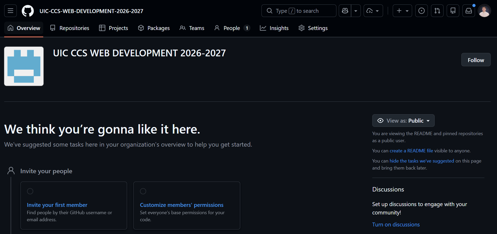

# 🏢 Welcome to UIC CCS WEB DEVELOPMENT 2026-2027

**Course:** CS008.23 - Web Applications Development 1 & 2  
**Instructor:** Mr. Joshua M. Cister  
**Organization Goal:** Enterprise Software Development Simulation  

Welcome to the official GitHub Organization for our Web Development series. This organization operates exactly like a modern software engineering firm. Instead of working in isolated personal accounts, you will collaborate, track issues, and deploy production-ready applications within this centralized workspace.

---

### 🚀 The Two-Semester Web Project
The Final Web project you pitch and begin building here is a continuous, two-semester enterprise application:

*   **Phase 1 (Web Dev 1 - Final Term):** You will engineer the **Frontend UI and Client-Side Logic** using React JS, Vite, static JSON/mock data, and automated CI/CD deployments (Vercel/Netlify).
*   **Phase 2 (Web Dev 2 - Next Semester):** You will use the *exact same repository* to build a **Custom Backend and Relational Database** (SQL, Node.js/PHP, User Authentication) and conduct professional **QA Testing** (automated, manual, and security testing).

Build your foundations cleanly now, because you will inherit your own codebase next term.

---

### 📋 Student Onboarding & Setup Instructions

To get started, follow this strict onboarding sequence. You can refer to the organization layout in the reference screenshot below to locate the necessary tabs (Overview, Repositories, Projects, Teams, etc.).

#### Step 1: Accept Your Invitation
Check your university email or GitHub notifications and accept the invitation to join this organization. Once inside, you will see the dashboard as depicted on the screenshot.

#### Step 2: Form Your Enterprise Team
1. Navigate to the **Teams** tab at the top of the organization page.
2. Create a new team using the format `Team-[YourProjectName]` (e.g., `Team-EduTrack`).
3. Add your group members to this team.

#### Step 3: Initialize the Official Repository
1. Navigate to the **Repositories** tab.
2. Click **New** to create your project repository. 
3. **CRITICAL:** Ensure the repository owner is set to the organization (`UIC-CCS-WEB-DEVELOPMENT-2026-2027`), NOT your personal GitHub account.
4. Name your repository professionally (e.g., `campus-relief-dashboard`) and initialize it with a `README.md`.

#### Step 4: Set Up Your Kanban Agile Board
We practice Ticket-Driven Development. You must track all coding progress using a Kanban board.
1. Navigate to the **Projects** tab at the top of the organization page.
2. Create a new Project Board and link it directly to your newly created repository.
3. Set up the four industry-standard columns: 
   * `Backlog (To-Do)`
   * `In Progress`
   * `QA / Review`
   * `Done`

#### Step 5: Start Sprinting
Before writing any React components, break your project pitch down into actionable tickets (e.g., "Build Navigation Bar", "Setup Tailwind CSS", "Create Vercel Pipeline"). Assign the tickets to your team members, drag them to `In Progress` when you start coding, and remember your Git lifecycle: **Save -> Stage -> Commit -> Push**.

---

### 🗓️ The 4-Week Agile Sprint Timeline
We are executing a rapid 4-week sprint to build our Phase 1 MVP.

| Timeline | Sprint Focus | Actionable Engineering Goals |
| :--- | :--- | :--- |
| **Week 1** | **Enterprise Setup & Architecture** | Assign team roles (Frontend, QA, Systems Analyst). Initialize the Vite + React repository in this Organization, deploy a blank shell to Vercel, and draft the `README.md` problem statement. |
| **Week 2** | **Component Shells & UI Assembly** | Translate concepts into static React components (`.jsx`) using CSS Flexbox, Grid, or Tailwind. Map out the dashboard, navigation, and data cards. |
| **Week 3** | **State Logic & Usability QA** | Wire up declarative state (`useState`) to render mock JSON data. Implement visual empty states ("No records found") and form validation guard clauses (`.trim()`, `e.preventDefault()`). |
| **Week 4** | **MVP Showcase & Terminal Defense** | Finalize the live Vercel deployment. Present the functional frontend, pitch the Web Dev 2 database architecture, and execute the 1-on-1 terminal code defense. |

---

### 📦 Submission Deliverables (Due Week 4)
To complete Phase 1 and secure your final grade, your team must submit the following:

1. **Live Production URL:** The working link to your React Single-Page Application deployed via **Vercel** or **Netlify**.
2. **Enterprise GitHub Repository:** Your codebase hosted specifically within this GitHub Organization. It must contain an active commit history and a complete `README.md` (including your Phase 2 pitch and AI usage disclosure).
3. **Agile Kanban Board:** The link to your GitHub Projects board showing your tracked tickets moved across the *Backlog*, *In Progress*, *QA/Review*, and *Done* columns.
4. **The Live Terminal Defense:** During the Week 4 presentation, every member must verbally defend their React syntax at the workstation and explain how the data flows through their components.
